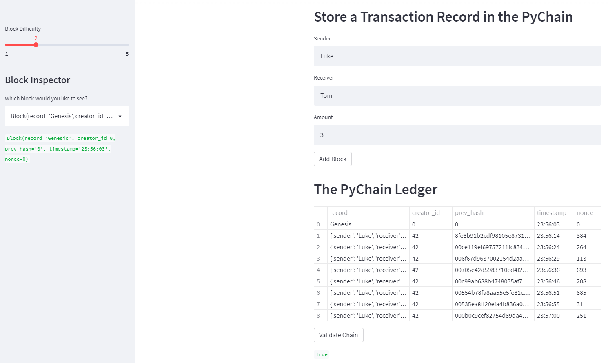

# 18_Blockchain

##  PyChain Ledger

### Background
This project aims to create a blockchain-based ledger system with a user-friendly online interface. This ledger enables partner banks to undertake financial transactions (that is, money transfers between senders and receivers) and validate the ledger's data integrity.

Steps completed:

1. Create a new data class named `Record`. This class will serve as the blueprint for the financial transaction records that the blocks of the ledger will store.

2. Modify the existing `Block` data class to store `Record` data.

3. Add Relevant User Inputs to the Streamlit interface.

4. Test the PyChain Ledger by Storing Records.

### Streamlit Application

Streamlit is a tool for quickly creating and sharing data apps.
In minutes, Streamlit transforms data scripts into shareable web apps.
Everything is written in Python. There is no requirement for prior frontend experience.

---
### File

[PyChain](My_Code/pychain.py)

---

### Built With

* vs code
* python
* streamlit
* pandas

---
